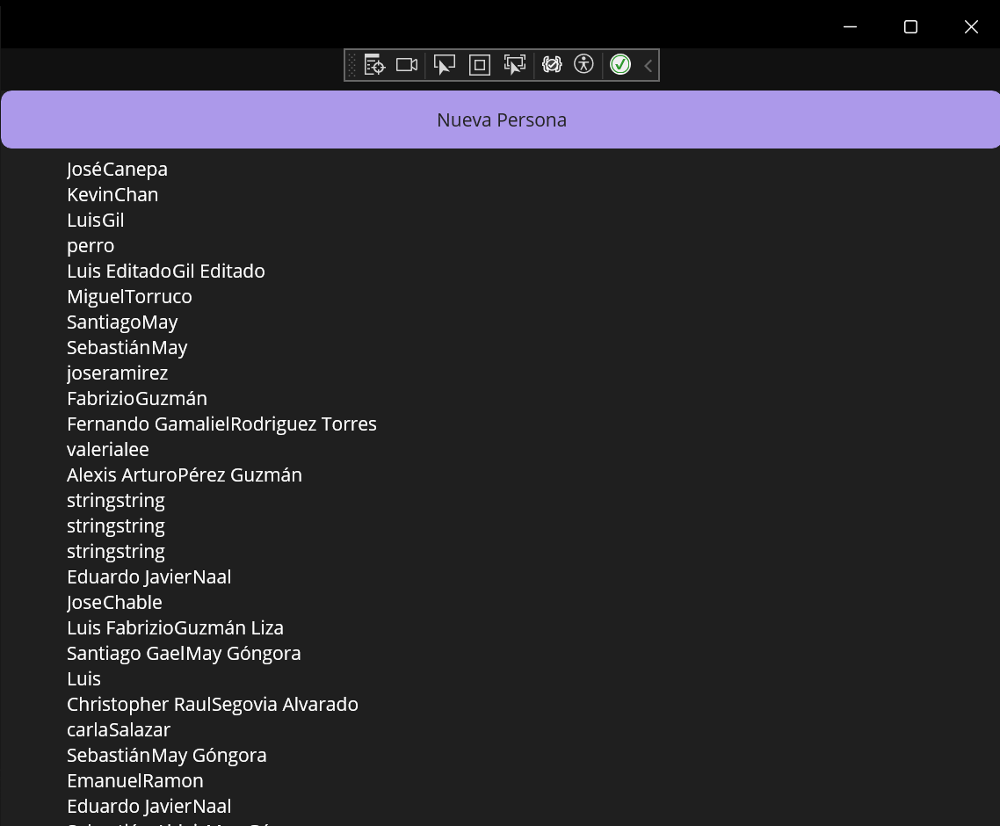
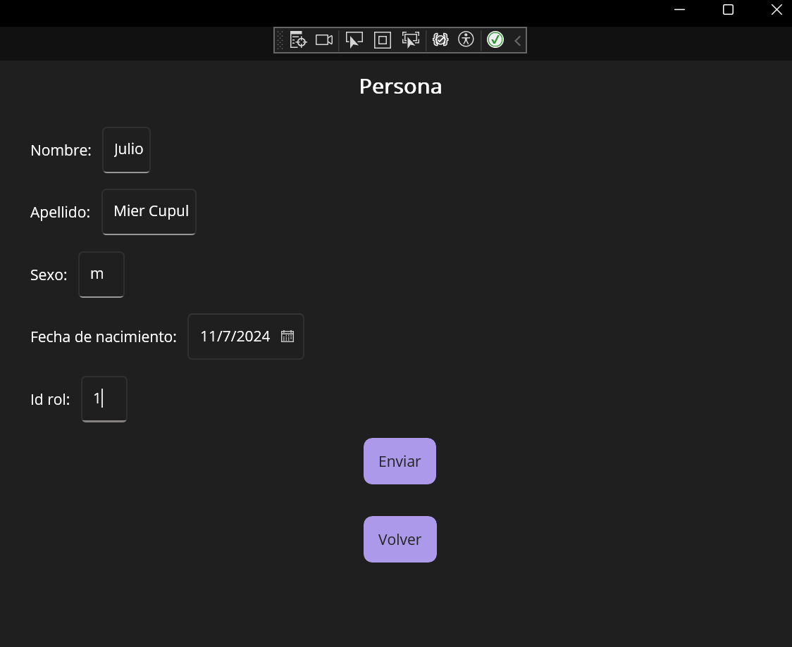

## Data Binding
Este proyecto es una aplicación multiplataforma desarrollada con .NET MAUI, que permite gestionar una lista de alumnos conectándose a un API a través de peticiones HTTP con JSON.

#### Estructura del Proyecto
1. MainPage (Vista de Lista de Alumnos):
Muestra una lista de alumnos obtenida del API en un control CollectionView.
Los elementos de la lista presentan el nombre y apellido de cada alumno.
Incluye un botón para navegar al formulario de registro.
2. FormPage (Formulario de Registro):
Contiene campos para capturar los datos de un alumno, según las especificaciones del API.
Envía los datos ingresados al servidor al guardar el registro.

#### Capturas:

*Vista principal que muestra la lista de alumnos.*

*Formulario para registrar un nuevo alumno.*